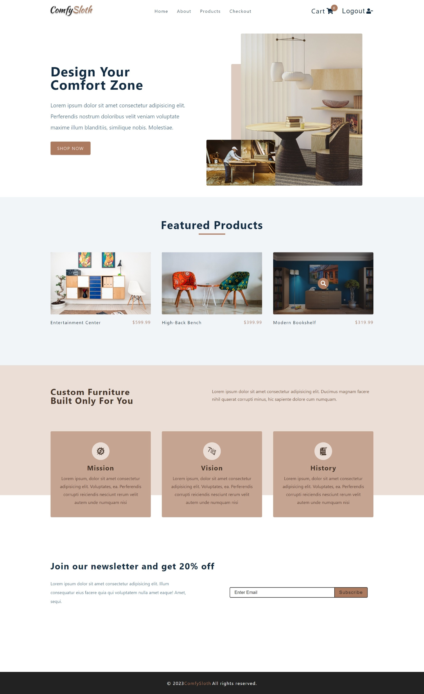
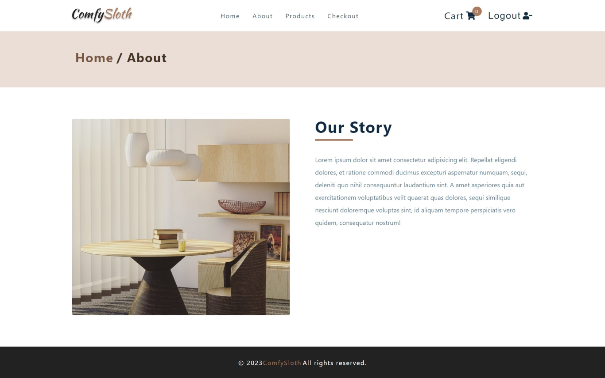
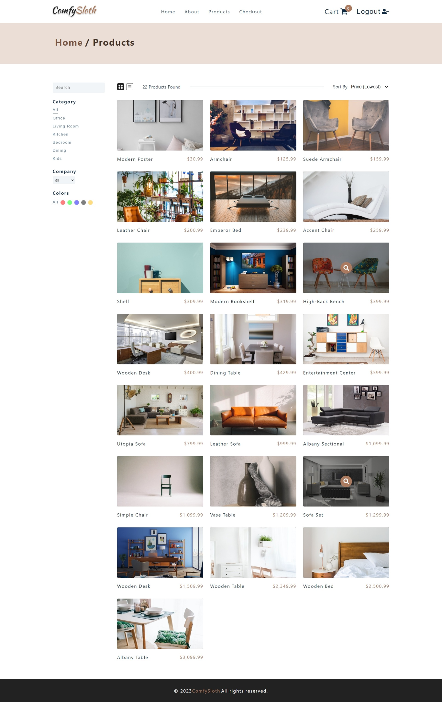
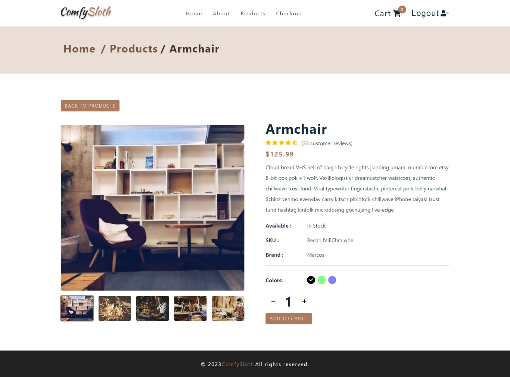
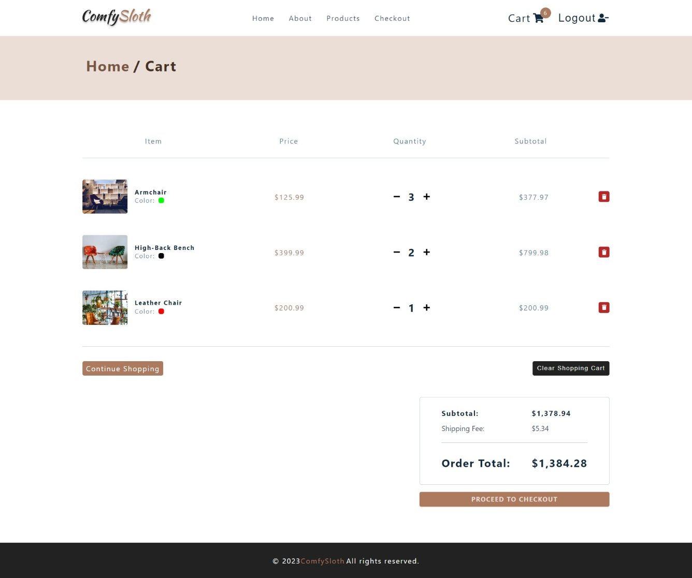

# Comfy E-Store


## 📃About The Project

- 🇺🇸 English

An E-commerce website built using React with Stripe for payment gateway.
This web app includes multiple pages like Products Page with option to filter your product search, Cart Page to review your purchases and Checkout Page to complete the purchase with Stripe Payment.
Auth0 is used for User Authentication before Checking out.

- 🇧🇷 Português

Um site de comércio eletrônico construído usando React with Stripe para gateway de pagamento. Este aplicativo da web inclui várias páginas, como página de produtos com opção para filtrar sua pesquisa de produtos, página de carrinho para revisar suas compras e página de check-out para concluir a compra com o Stripe Payment. Auth0 é usado para autenticação do usuário antes do check-out.



## 📄Pages

- Home Page
- Products Page
- Single Product Page
- About Page
- Error Page
- Cart Page
- Checkout Page






## 🛠️ Tools/Ferramentas

- styled components
- react hooks
- react router
- Authentication implemented using Auth0 React
- Payments using stripe
- Axios

## Run Locally

### 1. Clone this repository

```
$ git clone git@github.com:brunoanunciacaosouza/comfy-sloth.git
$ cd comfy-sloth-ecommerce-site-react
```

### 2. Create .env File

- create .env

```
    REACT_APP_AUTH_DOMAIN=<Your secret auth0 value>
    REACT_APP_CLIENT_ID=<Your secret auth0 value>
```

### 3. Run the app

```
$ npm install && npm start
```

The app will run in the development mode.
Open [http://localhost:3000](http://localhost:3000) to view it in your browser.
